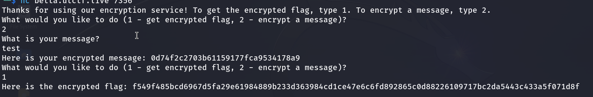
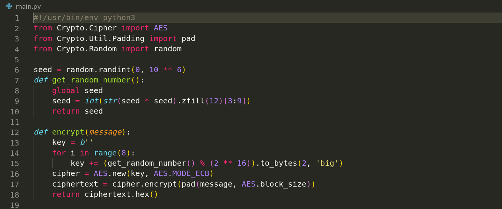
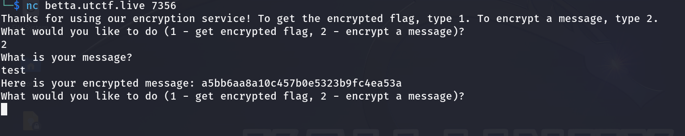
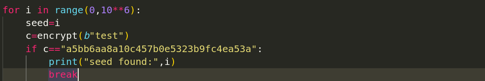
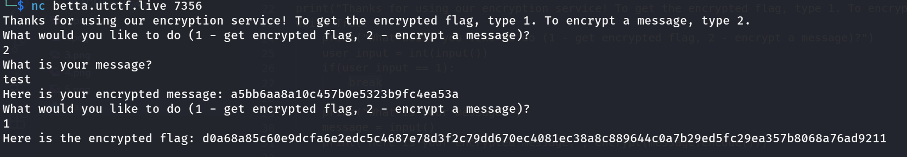
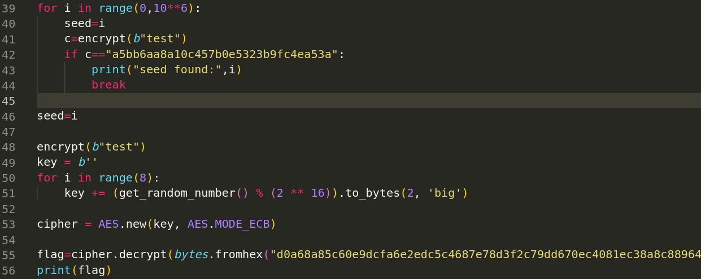

#numbers go brr writeup

We are given an instance and it's source code, when running it asks if we want to encrypt a message or if we want to get the flag 
encrypted and exit after.

let's look at the source code to see how the encryption works.

It generates a random seed, and it is doing some maths operations with the function get_random_number() to generate a random number 
and updates the value of seed with the random generated. For the encryption process it's generate a key using 8 generated randoms and
it uses [AES](https://en.wikipedia.org/wiki/Advanced_Encryption_Standard) to encrypt the message with the key generated.

Since AES is a symmetric cryptographic algorithm, we need to find the key in order to decrypt the flag. So the plan is to find the
seed, because if we find it we can repeat the same steps that the server is doing and we will reproduce the same key generated by the
server.

The vulnerability that will allow us to find the seed is in the line 6, the seed is too small and we can loop tought all possibilites
from 1 to 1000.000 in seconds, but how we can verify that we found the right seed?

Each seed will generate different randoms and different keys and if we have different keys we will have different encryptions, so
the idea is to ask server to encrypt a message for us, and we will loop tought all seeds and encrypt the same message and see which
seed gives the same encryption.

1-ask the server to encrypt a message for us:

2-loop tought all seed to find the right one:

3-ouput:

4-get encrypted flag:

5-now we will decrypt the flag using the key (remember to encrypt the message 'test' first to be at the same state of operations with server):

6-get the flag!

